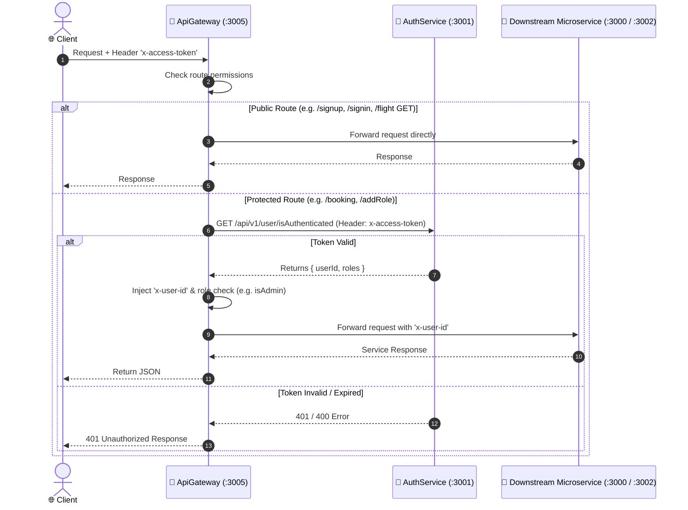

# 🚪 ApiGateway Microservice

[](https://expressjs.com/)
[]()
[](https://github.com/chimurai/http-proxy-middleware)

The **ApiGateway** serves as the single entry point, reverse proxy, and central security perimeter for the Flight Management System. It intercepts all incoming client traffic on port **`3005`**, enforces authentication and role-based access control, injects verified security claims into request headers, and dynamically forwards requests to the appropriate downstream microservices.

---

## ⚡ Key Features

- **Centralized Security Layer**: Validates client JWT tokens (`x-access-token`) once at the edge before requests reach internal microservices.
- **Identity & Role Injection**: Decodes user identity and injects `x-user-id` and verified role claims into downstream request headers.
- **Reverse Proxy Routing**: Employs `http-proxy-middleware` to forward client requests to target microservices with transparent path matching.
- **Circuit-Breaking / Fallback Handling**: Returns structured JSON error responses when downstream microservices are unreachable.

---

## 🏗️ Architecture & Middleware Pipeline



---

## ⚙️ Configuration & Environment Variables

Create a `.env` file in the `ApiGatway/` root directory:

```env
PORT=3005
FLIGHTSEARCH_SERVICE_PATH=http://localhost:3000
AUTH_SERVICE_PATH=http://localhost:3001
BOOKING_SERVICE_PATH=http://localhost:3002
REMINDER_SERVICE_PATH=http://localhost:3004
```

| Variable | Type | Description | Default |
| :--- | :--- | :--- | :--- |
| `PORT` | Number | Port on which the API Gateway listens | `3005` |
| `FLIGHTSEARCH_SERVICE_PATH` | URL | Target host for Flight Search Service | `http://localhost:3000` |
| `AUTH_SERVICE_PATH` | URL | Target host for Authentication Service | `http://localhost:3001` |
| `BOOKING_SERVICE_PATH` | URL | Target host for Booking Service | `http://localhost:3002` |
| `REMINDER_SERVICE_PATH` | URL | Target host for Reminder Notification Service | `http://localhost:3004` |

---

## 🛡️ Security Middlewares

The Gateway defines three core authorization guards in `src/middelwares/auth-middelware.js`:

1. **`isAuthenticated`**:
   - Reads `x-access-token` from incoming request headers.
   - Makes an HTTP request to `AUTH_SERVICE_PATH/api/v1/user/isAuthenticated`.
   - On success, attaches `req.headers['x-user-id'] = user.userId` and `req.userRoles = user.roles`.
   - If missing or invalid, immediately halts execution and returns `401 / 400`.

2. **`isAdmin`**:
   - Must run *after* `isAuthenticated`.
   - Checks if `'ADMIN'` exists in `req.userRoles`.
   - Halts with `401 Unauthorized` if the role is absent.

3. **`validateParamsUserId`**:
   - Must run *after* `isAuthenticated`.
   - Ensures that the authenticated user ID (`req.headers['x-user-id']`) matches the route parameter `:id`.
   - Prevents users from inspecting or deleting other users' accounts.

---

## 🗺️ Routing Table

All requests enter via `http://localhost:3005/api/v1`.

### 1. User & Authentication (`/user`)
| Method | Route | Middleware Guards | Target Microservice |
| :--- | :--- | :--- | :--- |
| `POST` | `/api/v1/user/signup` | *None (Public)* | `AuthService` |
| `POST` | `/api/v1/user/signin` | *None (Public)* | `AuthService` |
| `GET` | `/api/v1/user/:id` | `isAuthenticated`, `validateParamsUserId` | `AuthService` |
| `DELETE` | `/api/v1/user/:id` | `isAuthenticated`, `validateParamsUserId` | `AuthService` |
| `POST` | `/api/v1/user/addRole` | `isAuthenticated`, `isAdmin` | `AuthService` |

### 2. Flight Operations (`/flight`)
| Method | Route | Middleware Guards | Target Microservice |
| :--- | :--- | :--- | :--- |
| `POST` | `/api/v1/flight` | `isAuthenticated`, `isAdmin` | `FliteSearchService` |
| `PATCH`| `/api/v1/flight/:id`| `isAuthenticated`, `isAdmin` | `FliteSearchService` |
| `DELETE`| `/api/v1/flight/:id`| `isAuthenticated`, `isAdmin` | `FliteSearchService` |
| `GET` | `/api/v1/flight/:id`| *None (Public)* | `FliteSearchService` |
| `GET` | `/api/v1/flight` | *None (Public)* | `FliteSearchService` |

### 3. Resource Management (`/city`, `/airport`, `/airplane`)
| Method | Route | Middleware Guards | Target Microservice |
| :--- | :--- | :--- | :--- |
| `POST` | `/api/v1/city` | `isAuthenticated`, `isAdmin` | `FliteSearchService` |
| `PATCH`| `/api/v1/city/:id` | `isAuthenticated`, `isAdmin` | `FliteSearchService` |
| `DELETE`| `/api/v1/city/:id`| `isAuthenticated`, `isAdmin` | `FliteSearchService` |
| `GET` | `/api/v1/city/:id` | *None (Public)* | `FliteSearchService` |
| `GET` | `/api/v1/city` | *None (Public)* | `FliteSearchService` |
| `POST` | `/api/v1/airport` | `isAuthenticated`, `isAdmin` | `FliteSearchService` |
| `PATCH`| `/api/v1/airport/:id` | `isAuthenticated`, `isAdmin` | `FliteSearchService` |
| `DELETE`| `/api/v1/airport/:id`| `isAuthenticated`, `isAdmin` | `FliteSearchService` |
| `GET` | `/api/v1/airport/:id` | *None (Public)* | `FliteSearchService` |
| `GET` | `/api/v1/airport` | *None (Public)* | `FliteSearchService` |
| `ALL` | `/api/v1/airplane/*` | `isAuthenticated`, `isAdmin` | `FliteSearchService` |

### 4. Bookings (`/booking`)
| Method | Route | Middleware Guards | Target Microservice |
| :--- | :--- | :--- | :--- |
| `POST` | `/api/v1/booking` | `isAuthenticated` | `Bookingservice` |
| `GET` | `/api/v1/booking/:id` | `isAuthenticated` | `Bookingservice` |
| `GET` | `/api/v1/booking` | `isAuthenticated` | `Bookingservice` |

---

## 💻 cURL Testing Examples

### 1. Register a New User
```bash
curl -X POST http://localhost:3005/api/v1/user/signup \
  -H "Content-Type: application/json" \
  -d '{
    "userName": "john_doe",
    "email": "john@example.com",
    "password": "Password123!"
  }'
```

### 2. Login to Obtain JWT Token
```bash
curl -X POST http://localhost:3005/api/v1/user/signin \
  -H "Content-Type: application/json" \
  -d '{
    "email": "john@example.com",
    "password": "Password123!"
  }'
```
*Save the returned `data` JWT token for subsequent requests.*

### 3. Search Available Flights (Public)
```bash
curl -X GET "http://localhost:3005/api/v1/flight"
```

### 4. Book a Flight Ticket (Authenticated)
```bash
curl -X POST http://localhost:3005/api/v1/booking \
  -H "Content-Type: application/json" \
  -H "x-access-token: <YOUR_JWT_TOKEN>" \
  -d '{
    "flightId": 1,
    "seats": 2
  }'
```

---

## 🛠️ Local Development

```bash
# Install dependencies
npm install

# Start development server with Nodemon auto-reload
npm start
```
