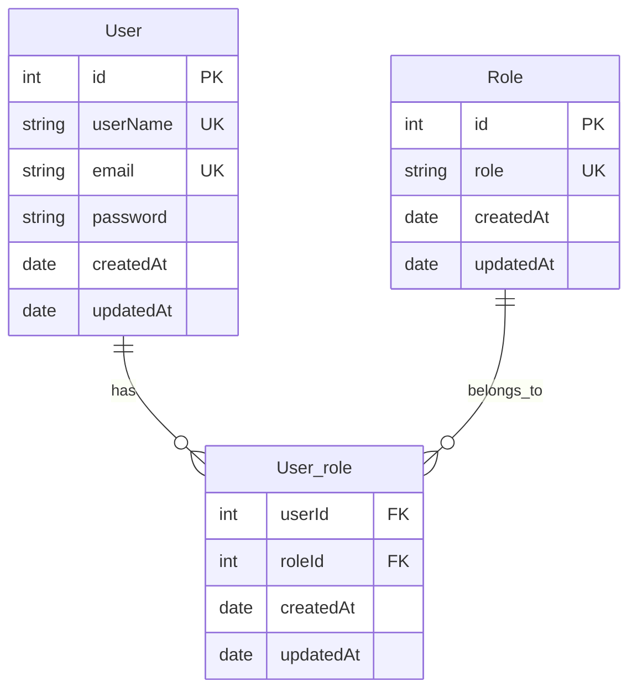

# 🔐 AuthService Microservice

[](https://expressjs.com/)
[]()
[](https://sequelize.org/)
[](https://www.mysql.com/)

The **AuthService** is the authentication and authorization microservice of the Flight Booking Management System. It manages user registration, credential validation, role-based permissions (`ADMIN`, `COSTOMER`), password hashing via `bcrypt`, and secure stateless JSON Web Token (JWT) issuance.

---

## ⚡ Key Capabilities

- **Stateless Authentication**: Issues cryptographically signed JWT tokens containing user credentials and roles.
- **Secure Password Hashing**: Implements salted password hashing via `bcrypt` through Sequelize lifecycle hooks.
- **Role-Based Access Control (RBAC)**: Many-to-many user and role associations (`User` ↔ `Role` via `User_role`).
- **Automated Customer Provisioning**: Automatically attaches the default `COSTOMER` role upon new user registration using a Sequelize `afterCreate` hook.
- **Token Verification Endpoint**: Provides an internal verification API (`/isAuthenticated`) used by the API Gateway to validate client tokens.

---

## 🏗️ Architecture & Database Design

### Entity Relationship Diagram



### Sequelize Hooks Implementation
- **`beforeCreate`**: Hashes plaintext passwords using `bcrypt.hashSync(user.password, saltRound)` before saving to MySQL.
- **`afterCreate`**: Looks up the `'COSTOMER'` role in the `Role` table and automatically executes `user.addRole(customerRole)` to grant baseline permissions.

---

## ⚙️ Configuration & Setup

### 1. Environment Variables (`.env`)
Create a `.env` file in the `AuthService/` directory:

```env
PORT=3001
saltRound=11
JWT_KEY=your_secure_random_jwt_secret_key
```

| Variable | Type | Description | Default |
| :--- | :--- | :--- | :--- |
| `PORT` | Number | Port on which AuthService listens | `3001` |
| `saltRound` | Number | Cost factor / rounds for bcrypt salt generation | `11` |
| `JWT_KEY` | String | Symmetric secret used to sign and verify JWT tokens | *(Secret String)* |

### 2. Database Configuration (`src/config/config.json`)
Configure your MySQL database connection parameters:

```json
{
  "development": {
    "username": "root",
    "password": "your_mysql_password",
    "database": "Auth_DB_dev",
    "host": "127.0.0.1",
    "dialect": "mysql"
  }
}
```

### 3. Migrations and Role Seeding
```bash
# Create the database (via MySQL CLI)
mysql -u root -p -e "CREATE DATABASE IF NOT EXISTS Auth_DB_dev;"

# Run migrations to create User, Role, and User_role tables
npx sequelize db:migrate

# Seed initial roles (ADMIN, COSTOMER)
npx sequelize db:seed:all
```

---

## 🛣️ API Endpoints Reference

Base Path: `http://localhost:3001/api/v1/user`

| Method | Endpoint | Description | Auth Required |
| :--- | :--- | :--- | :---: |
| `POST` | `/signup` | Registers a new user account | ❌ No |
| `POST` | `/signin` | Authenticates credentials and returns JWT token | ❌ No |
| `GET` | `/isAuthenticated` | Validates JWT token and returns user ID & roles | 🔒 Header Token |
| `GET` | `/:id` | Fetches user profile by ID | 🔒 Internal / Protected |
| `DELETE`| `/:id` | Deletes user account by ID | 🔒 Internal / Protected |
| `POST` | `/addRole` | Assigns a specific role to a user | 🔒 Admin |
| `GET` | `/isAdmin/:id` | Verifies whether a user has the `ADMIN` role | 🔒 Protected |

---

## 📝 Request & Response Specifications

### 1. User Registration (`POST /signup`)
**Request Body:**
```json
{
  "userName": "nirbhay_singh",
  "email": "nirbhay@example.com",
  "password": "StrongPassword123"
}
```

**Success Response (`201 Created`):**
```json
{
  "data": {
    "id": 1,
    "userName": "nirbhay_singh",
    "email": "nirbhay@example.com",
    "updatedAt": "2026-09-10T15:30:00.000Z",
    "createdAt": "2026-09-10T15:30:00.000Z"
  },
  "success": true,
  "message": "successfully created user",
  "error": {}
}
```

---

### 2. User Signin (`POST /signin`)
**Request Body:**
```json
{
  "email": "nirbhay@example.com",
  "password": "StrongPassword123"
}
```

**Success Response (`200 OK`):**
```json
{
  "data": "eyJhbGciOiJIUzI1NiIsInR5cCI6IkpXVCJ9...",
  "success": true,
  "message": "successfully sign in user",
  "error": {}
}
```

---

### 3. Verify Token (`GET /isAuthenticated`)
**Headers:**
```http
x-access-token: eyJhbGciOiJIUzI1NiIsInR5cCI6IkpXVCJ9...
```

**Success Response (`200 OK`):**
```json
{
  "data": {
    "userId": 1,
    "roles": ["COSTOMER"]
  },
  "success": true,
  "message": "successfully verified user",
  "error": {}
}
```

---

### 4. Assign Role (`POST /addRole`)
**Request Body:**
```json
{
  "userId": 1,
  "role": "ADMIN"
}
```

**Success Response (`200 OK`):**
```json
{
  "data": true,
  "success": true,
  "message": "successfully added role to user",
  "error": {}
}
```

---

## 💻 cURL Testing Examples

```bash
# Register
curl -X POST http://localhost:3001/api/v1/user/signup \
  -H "Content-Type: application/json" \
  -d '{"userName":"john","email":"john@test.com","password":"secretpassword"}'

# Login
curl -X POST http://localhost:3001/api/v1/user/signin \
  -H "Content-Type: application/json" \
  -d '{"email":"john@test.com","password":"secretpassword"}'

# Verify Token
curl -X GET http://localhost:3001/api/v1/user/isAuthenticated \
  -H "x-access-token: <PASTE_JWT_TOKEN_HERE>"
```

---

## 🛠️ Local Development

```bash
npm install
npm start
```
