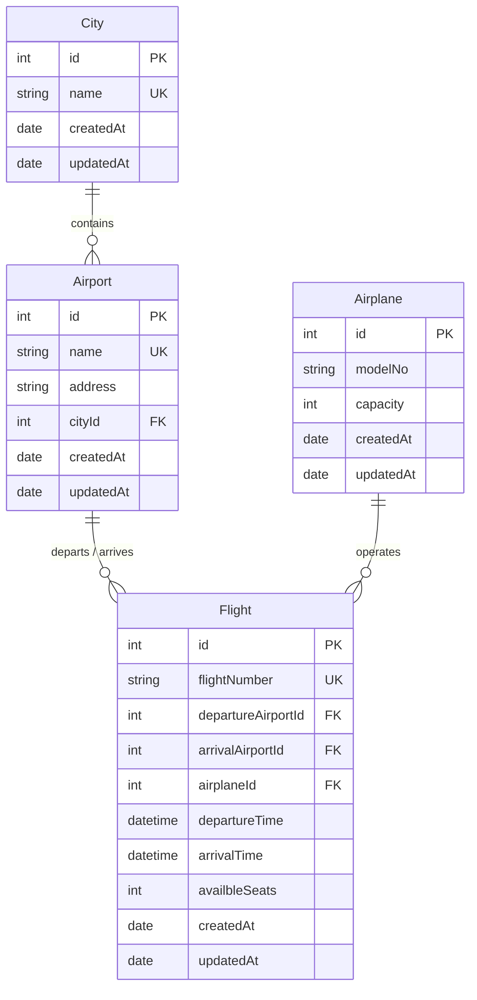

# 🛫 FliteSearchService Microservice

[](https://expressjs.com/)
[]()
[](https://sequelize.org/)
[](https://www.mysql.com/)

The **FliteSearchService** is the core catalog and operations microservice in the Flight Booking Management System. Running on port **`3000`**, it manages airplanes, airports, cities, and flight schedules, dynamically initializing seat capacities from aircraft specifications and supporting flight search and inventory queries.

---

## ⚡ Key Capabilities

- **Flight Inventory Management**: Tracks flight numbers, departure/arrival hubs, flight times, and real-time available seat counts (`availbleSeats`).
- **Automated Seat Initialization**: Automatically populates `availbleSeats` on flight creation based on the associated airplane's capacity.
- **Relational Domain Model**: Clean relational mappings between Cities, Airports, Aircraft, and Flight legs.
- **Robust Input Validation**: Modular middleware layer validating mandatory attributes for all resource operations (`create` and `update`).

---

## 🏗️ Architecture & Database Design

### Entity Relationship Diagram



---

## ⚙️ Configuration & Setup

### 1. Environment Variables (`.env`)
Create a `.env` file in the `FliteSearchService/` root directory:

```env
PORT=3000
```

### 2. Database Configuration (`src/config/config.json`)
Configure your MySQL database parameters:

```json
{
  "development": {
    "username": "root",
    "password": "your_mysql_password",
    "database": "FliteSearchDBdev",
    "host": "127.0.0.1",
    "dialect": "mysql"
  }
}
```

### 3. Migrations and Seeders
```bash
# Create database in MySQL
mysql -u root -p -e "CREATE DATABASE IF NOT EXISTS FliteSearchDBdev;"

# Run migrations
npx sequelize db:migrate

# Seed sample data (Airplanes, Cities, Airports)
npx sequelize db:seed:all
```

---

## 🛣️ API Endpoints Reference

Base Path: `http://localhost:3000/api/v1`

### 1. Flights (`/flight`)
| Method | Endpoint | Description | Request Body / Parameters |
| :--- | :--- | :--- | :--- |
| `POST` | `/flight` | Create new flight schedule | `flightNumber`, `departureAirportId`, `arrivalAirportId`, `airplaneId`, `departureTime`, `arrivalTime` |
| `PATCH`| `/flight/:id` | Update flight parameters | Partial flight fields |
| `DELETE`| `/flight/:id`| Delete flight schedule | Route param `:id` |
| `GET` | `/flight/:id` | Get flight details by ID | Route param `:id` |
| `GET` | `/flight` | List flights / search query | Query parameters |

### 2. Airports (`/airport`)
| Method | Endpoint | Description | Mandatory Body |
| :--- | :--- | :--- | :--- |
| `POST` | `/airport` | Add an airport | `name`, `address`, `cityId` |
| `PATCH`| `/airport/:id`| Update airport details | Partial airport fields |
| `DELETE`| `/airport/:id`| Delete airport | Route param `:id` |
| `GET` | `/airport/:id` | Retrieve airport by ID | Route param `:id` |
| `GET` | `/airport` | List all airports | *None* |

### 3. Cities (`/city`)
| Method | Endpoint | Description | Mandatory Body |
| :--- | :--- | :--- | :--- |
| `POST` | `/city` | Create city record | `name` |
| `PATCH`| `/city/:id` | Update city name | `name` |
| `DELETE`| `/city/:id` | Delete city | Route param `:id` |
| `GET` | `/city/:id` | Get city by ID | Route param `:id` |
| `GET` | `/city` | List all cities | *None* |

### 4. Airplanes (`/airplane`)
| Method | Endpoint | Description | Mandatory Body |
| :--- | :--- | :--- | :--- |
| `POST` | `/airplane` | Register aircraft | `modelNo`, `capacity` |
| `PATCH`| `/airplane/:id`| Update aircraft | Partial airplane fields |
| `DELETE`| `/airplane/:id`| Delete aircraft | Route param `:id` |
| `GET` | `/airplane/:id`| Get aircraft by ID | Route param `:id` |
| `GET` | `/airplane` | List all aircraft | *None* |

---

## 📝 Request & Response Specifications

### Create Flight (`POST /api/v1/flight`)
**Request Body:**
```json
{
  "flightNumber": "AI-101",
  "departureAirportId": 1,
  "arrivalAirportId": 2,
  "airplaneId": 1,
  "departureTime": "2026-10-01T08:00:00.000Z",
  "arrivalTime": "2026-10-01T10:30:00.000Z"
}
```

**Success Response (`201 Created`):**
```json
{
  "data": {
    "id": 1,
    "flightNumber": "AI-101",
    "departureAirportId": 1,
    "arrivalAirportId": 2,
    "airplaneId": 1,
    "availbleSeats": 200,
    "departureTime": "2026-10-01T08:00:00.000Z",
    "arrivalTime": "2026-10-01T10:30:00.000Z",
    "createdAt": "2026-09-10T15:30:00.000Z",
    "updatedAt": "2026-09-10T15:30:00.000Z"
  },
  "success": true,
  "message": "successfully created flight",
  "error": {}
}
```

---

## 💻 cURL Testing Examples

```bash
# 1. Create a City
curl -X POST http://localhost:3000/api/v1/city \
  -H "Content-Type: application/json" \
  -d '{"name": "New Delhi"}'

# 2. Create an Airport
curl -X POST http://localhost:3000/api/v1/airport \
  -H "Content-Type: application/json" \
  -d '{
    "name": "Indira Gandhi International Airport",
    "address": "New Delhi, Delhi 110037",
    "cityId": 1
  }'

# 3. Create an Airplane
curl -X POST http://localhost:3000/api/v1/airplane \
  -H "Content-Type: application/json" \
  -d '{"modelNo": "Boeing 777", "capacity": 300}'

# 4. Get Flight by ID
curl -X GET http://localhost:3000/api/v1/flight/1
```

---

## 🛠️ Local Development

```bash
npm install
npm start
```